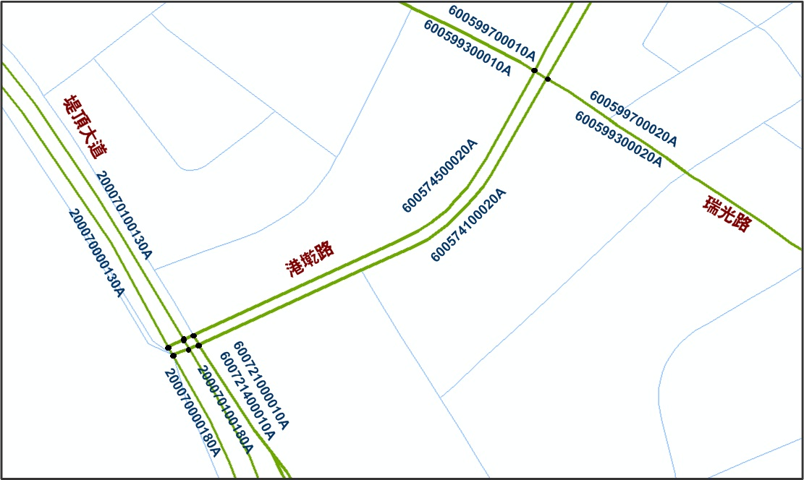

# 前言

&emsp;&emsp;交通資訊(Traffic Information)除數據資料如車速、旅行時間、交通流量外，亦須載明所在之地理位置，對於交通資訊的使用者而言始具實質意義。地理位置的表示又稱為「位置參照(Location Reference)」，交通應用領域裡常使用「預碼法」作為交通資訊的位置參照。所謂「預碼法」是預先將特定的空間位置(如路段)給予唯一的編碼，欲參照某位置時，只須指明這個位置的編碼即可。為使路段編碼本身具有快速篩選的功能，以利交通資訊的查詢，路段編碼須進行多碼段結構化的設計，各碼段具有特定意義，即可快速檢索特定路段的交通資訊。結構化的路段編碼是查詢交通資訊時的一種索引，亦是各項交通資訊服務的共通基礎。

&emsp;&emsp;為因應未來多元資訊之蒐集、發布及交換之需求，交通部已針對全國主要道路訂定「全國交通資訊基礎路段編碼」規範進行「道路分段」與「路段編碼」，主要道路包括：國道、省道快速公路、市區快速道路(以上均含匝道，但不含服務區道路)、省道一般公路、縣道、鄉道、重要市區道路(不含機慢車道)，以及路名含「街」之路寬15米(含)以上的市區道路，排除巷、弄，其中，產業道路及無路名道路原則不納入第一階段交通資訊基礎路段之編碼範疇，惟有交通資訊發布需求（如路側設施布設、重要運輸場站位置及重要景點連絡道）之道路適當納入。圖中的綠色線段為全國交通資訊基礎路段於市區部分的示意圖，淺藍色線段為巷弄。

