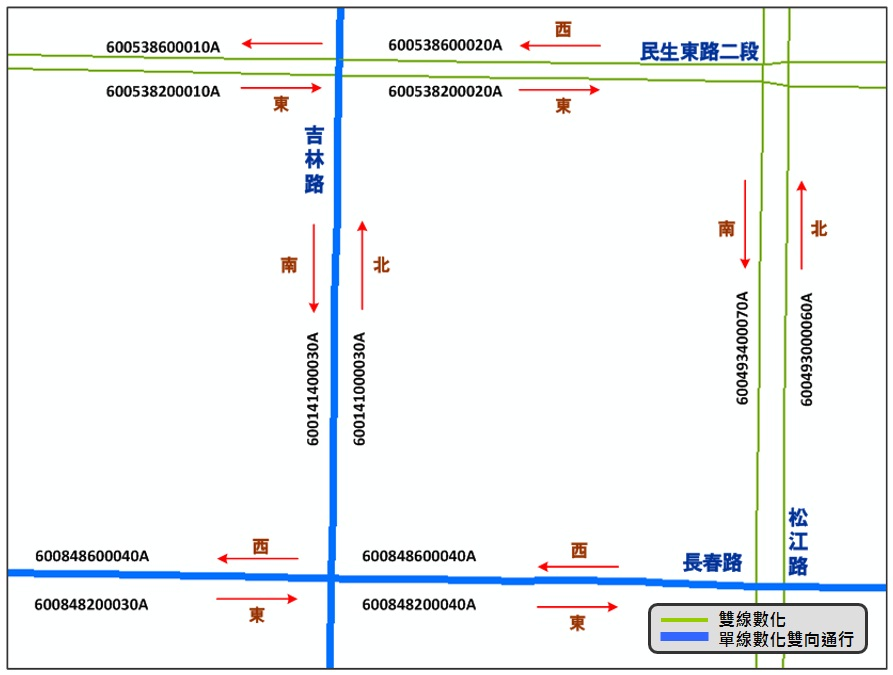
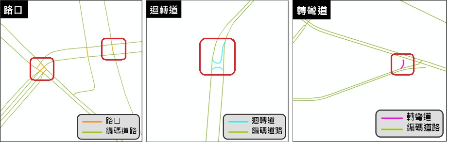

「交通資訊基礎路段」之路段考量方向性，同向道路不區分主副車道。現有臺灣通用電子地圖之路段是以道路中心線表示其幾何資料，可以單線表示兩個行車方向，亦可以雙線分別表示兩個相反方向，其中，不具分隔島的雙向道路以單線表示其道路中線(道路邊緣線等分中心之連線)；國道、省市快速道路、具分隔島之市區道路，以雙線表示不同車行方向之道路中線；如下圖的民生東路二段、松江路，道路具中央分隔島，故以雙線表示兩相反之車行方向，長春路、吉林路，則以單線表示兩個車行方向。

前述以雙線表示不同車行方向之路段，雙線將擁有個別的路段編碼。至於以單線表示兩車行方向之路段，則須將此類型線段進行複製及方向反轉，使其成為雙線各自擁有其路段編碼，同時以利未來道路資訊之發布與展示，複製及方向反轉後之路段示意圖如下圖所示。其中，吉林路、長春路於臺灣通用電子地圖皆為單線表示兩車行方向之道路(下圖的藍色線段)，而於「交通資訊基礎路段」應將這些線段進行複製及方向反轉，產生雙向之編碼 (如下圖紅色線段所示)。

此外，由於臺灣通用電子地圖為數化方式之故，在兩雙線道路十字相交及雙線道路、單線道路相交處，將分別形成特殊井字形與雙十字的情形，這些交叉路乃由於數化所產生的短線段因不具實質意義，另迴轉道與轉彎道數化結果亦同如下圖所示，故不納入「交通資訊基礎路段」對象之中。

