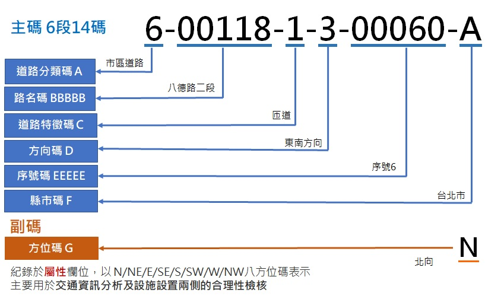

&emsp;&emsp;交通資訊基礎路段之編碼係為交通資訊變化頻繁且有大量查詢需求，故除考量編碼本身的識別性外，更重要的是應考量編碼的使用性(Usability)。下圖為交通資訊基礎路段編碼各碼段之定義，計有：道路分類碼(1碼)、路名碼(5碼)、道路特徵碼(1碼)、方向碼(1碼)、序號碼(5碼)與縣市碼(1碼)等6碼段共計主碼14碼，方位碼副碼1-2碼(副碼資訊記載於路段Link圖層屬性欄位中)，茲依各碼段分述如後。

