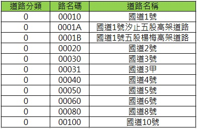
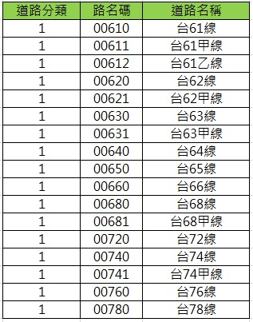
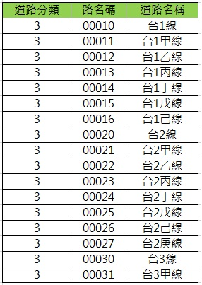
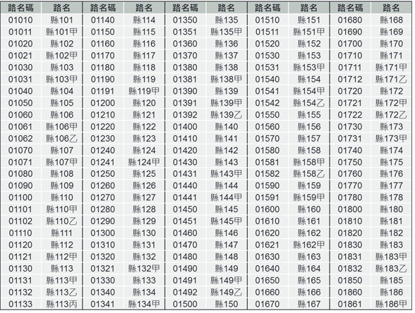
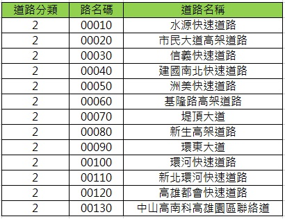
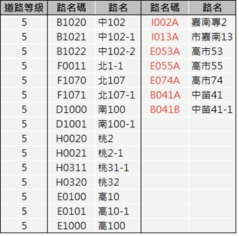
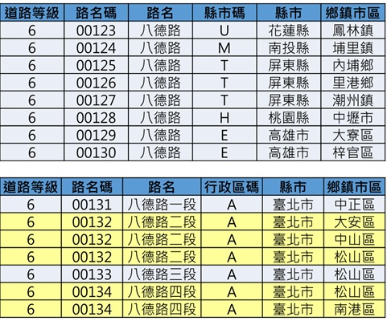
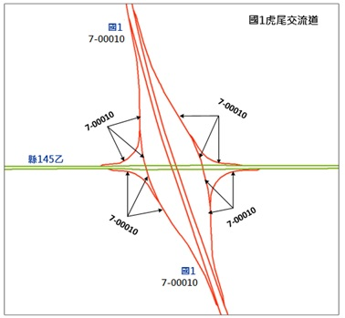
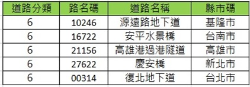
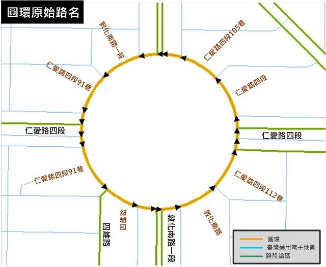

&emsp;&emsp;路名碼依不同道路分類有不同之編碼規則，茲分述如后。

1\. 國道、省道快速公路、省道一般公路、縣道

&emsp;&emsp;此四類道路之路名碼前4碼為主線編號，如: 國1為00010，國10為00100，全台共8條主線(另1條支線)，範圍自01至10。第5碼為主支線編號或特例(A,B,C…)，其中0表示主線，1~9 為支線碼，分別代表[甲-壬] (甲:1, 乙:2,…)。下列表格分別為國道、省道快速公路、省道一般公路、縣道路名碼範例。

2\. 市區快速道路

&emsp;&emsp;市區快速道路之路名碼前4碼為流水號，第5碼為支線編號。前4碼流水號之編碼由交通部統一維護並發布。下表為市區快速道路路名碼範例。

3\. 鄉道(含區道)

&emsp;&emsp;第1碼為所屬縣市代碼。2~4碼為主線編號。第5碼為支線編號或特例，如專線、跨縣市鄉道(含區道)、跨縣市鄉道(含區道)支線等(以A,B,C…順序依序表示，A:第一條跨縣市道路、B為第二條依序表示)，下表為鄉道(含區道)路名碼範例。

4\. 市區道路

&emsp;&emsp;5碼流水號，路名包含段數，如八德路一段與八德路二段之路名碼不同。此外，不同縣市或同縣市不同鄉鎮市區內之同名道路亦應擁有不同之路名碼，惟同縣市不同鄉鎮市區內之同名道路其路段連續時，則其路名碼編碼相同。全台不重覆路名約共28,000條左右，市區道路路名流水號應以縣市為單位針對既有路名進行編碼，如：臺北市路名碼為[0~3000]、新北市路名碼為[3001~8000]，依此類推。各縣市路名碼之範圍可預留新建道路空間，未來若不足時，再自路名碼最大值向後遞編。同縣市內路名碼可依中文路名進行排序，以利維護。市區道路路名碼之編碼須經交通部核定後統一發布並維護。下表則為市區道路路名碼之編碼範例。

5\. 匝道

&emsp;&emsp;路名碼同主線道路或服務區/休息區名，如遇連接同級道路之匝道名各自編碼，下圖為國道匝道歸屬道路主線範例。

6\. 橋梁、隧道、地下道

&emsp;&emsp;橋梁連接橋梁的兩側道路，若路名同，考量其路名連續性問題，該橋梁路段以該路名編碼；如連續橋梁的兩側道路路名不同者，且橋梁本身無路名，以原橋梁名編列路名碼。隧道及地下道之路名碼編列方式亦同，下表為橋梁、隧道、地下道路名碼範例。

7\. 圓環

&emsp;&emsp;圓環之路名碼以銜接之重要道路名稱由本案整併為單一名稱編列，惟業管單位有正式命名時，以正式名稱編列路名碼，下圖為圓環路名碼範例。

