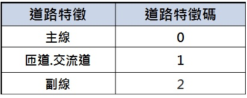
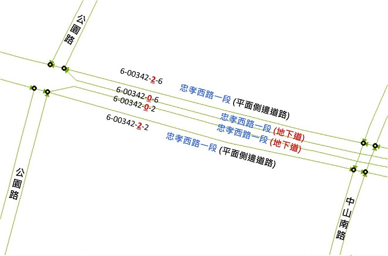
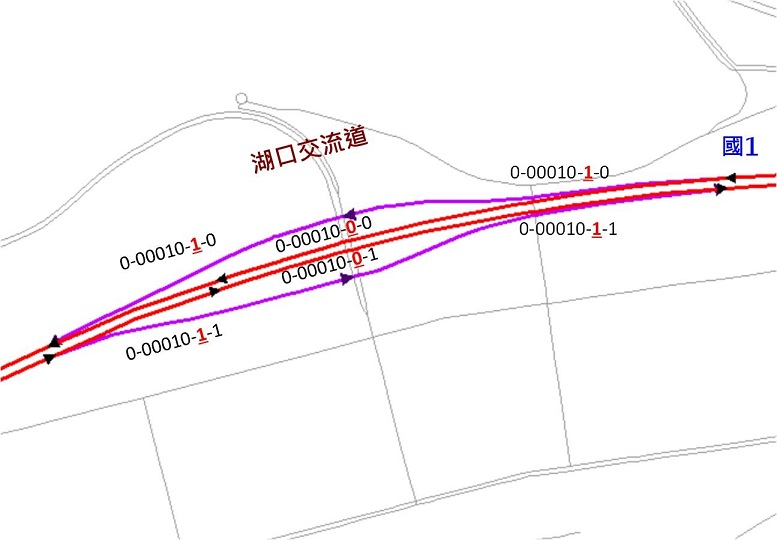

&emsp;&emsp;道路特徵碼為一碼數字，如下表。

&emsp;&emsp;因交通資訊基礎路段擁有特殊路段之需求，「道路特徵碼」用以紀錄匝道、主線及副線，後續並可擴充於特殊路段之需求，而對於同一條路名道路，不論主線/匝道/副線，其主「路名碼」將可保持一致性。其餘道路一般狀態下，道路特徵碼為0，但當同一路段同時有數個不同結構(相同路名)，則依實際狀態將地下道(或高架路段)、平面道路設為主副線，以茲區別。

1\. 主線及副線

&emsp;&emsp;一般道路一般狀態下，道路特徵碼為0，但當同一路段同時有數個不同結構(相同路名)，則依實際狀態將地下道(或高架路段)、平面道路設為主副線，以茲區別。

2\. 匝道及交流道

&emsp;&emsp;國道，省快，市快的交流道(匝道)之道路特徵碼為1，主線為0。

