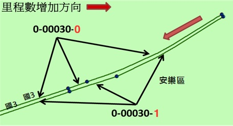
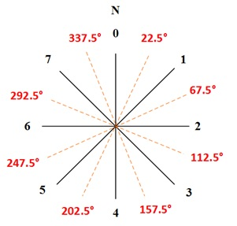
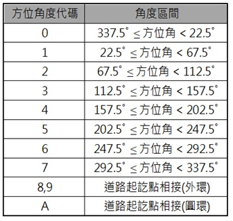
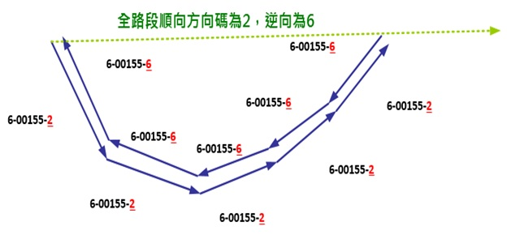
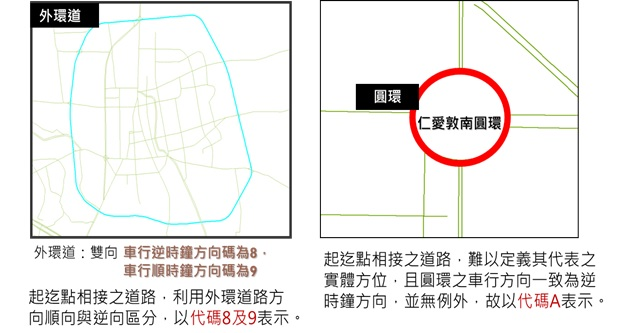
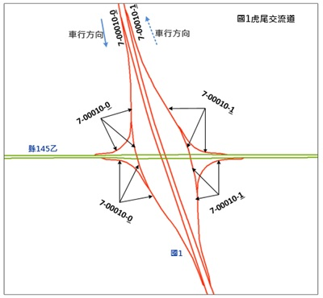
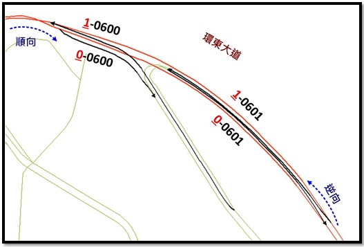
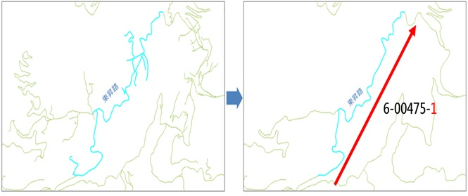

&emsp;&emsp;依據交通資訊基礎路段分向不分道原則，基礎路段應依道路走向編有1碼之方向碼。方向碼於公路（含市區快道路）以里程增減概分「順向」與「逆向」兩類，市區道路則為便於使用者方位認知，以道路於地圖實體方位碼區別，自北方順時針方向起算區分為8個方向，其代碼以0\~7表示，另針對外環道及圓環有特殊之代碼。

1\. 國道、省道快速公路、市區快速道路、省道一般公路、縣道、鄉道(含區道)

&emsp;&emsp;–	順向為「里程數增加的方向」，順向之方向碼為數字0。

&emsp;&emsp;–	逆向為「里程數減少的方向」，逆向之方向碼為數字1。

2\. 市區一般道路

&emsp;&emsp;–	以連續同一路名道路起點至迄點所產生之方向作為道路方向，自北方順時針方向起算區分為8個方向，其代碼以0~7表示。

&emsp;&emsp;–	外環道為起迄點相接之道路，且通常由多段道路銜接，其全路段之方向碼無法使用0-7表示，又其特性相異於圓環。故新增專為表示外環道之方向碼，利用外環道路方向順向與逆向之分，將方向碼拆解成8及9。

&emsp;&emsp;–	圓環車流方向一致，且無明顯道路起迄，無法準確定義其道路方向，方向碼以A表示。

3\. 匝道(含國道交流道及快速道路匝道)

&emsp;&emsp;–	以上游主線方向碼編列

&emsp;&emsp;&emsp;&emsp;–	國道交流道及市區快速道路匝道方向碼，主要同上游主線依全路段走向，南北向及東西向為順向0，反之逆向1。

4\. 山區道路

&emsp;&emsp;–	刪除支線道路並以該道路之主線道路走向編列。

