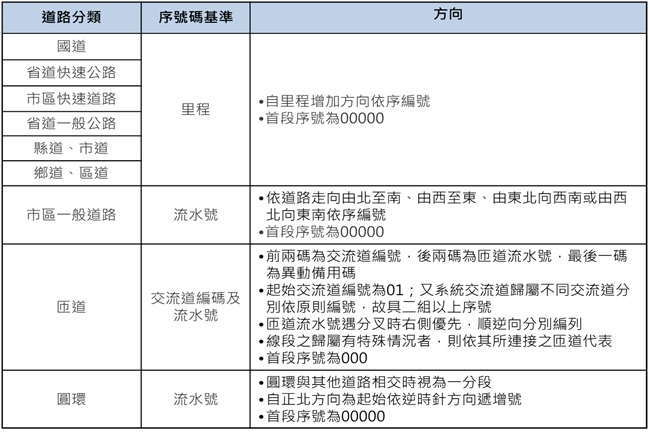
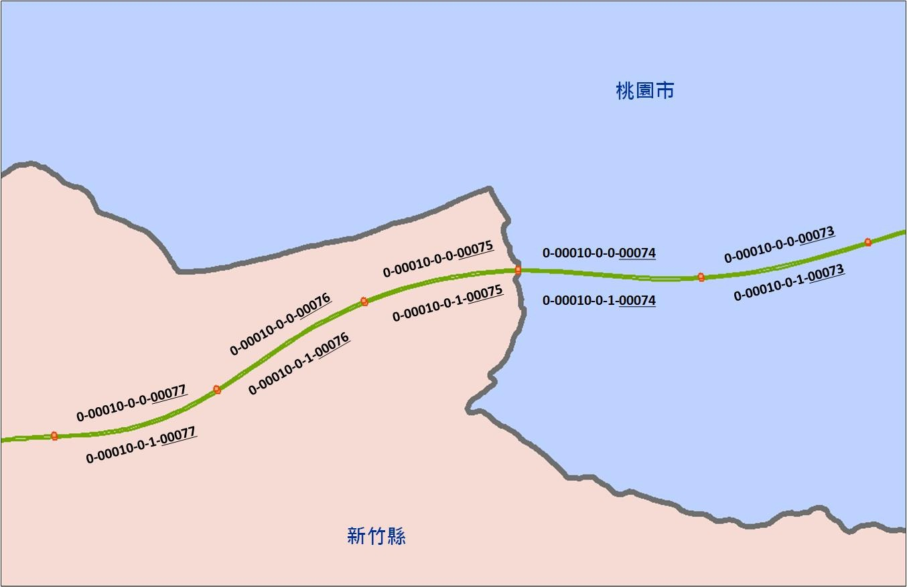
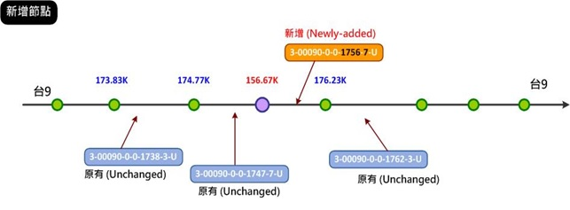
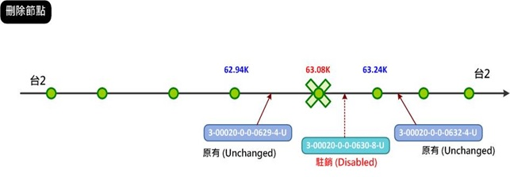
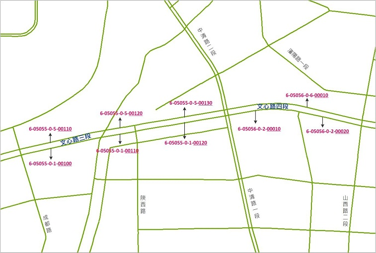
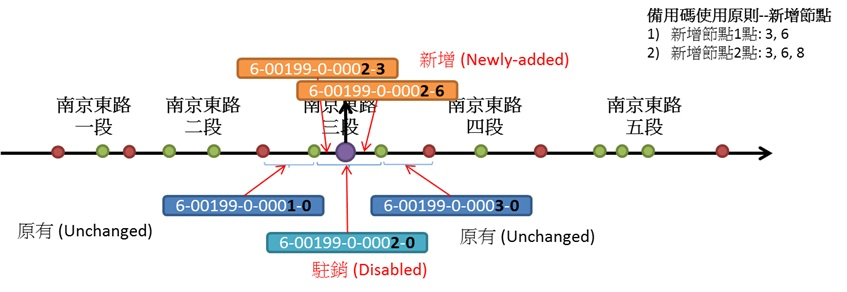
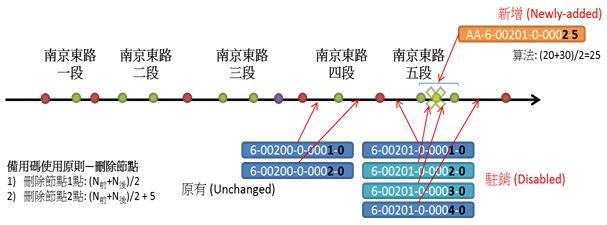
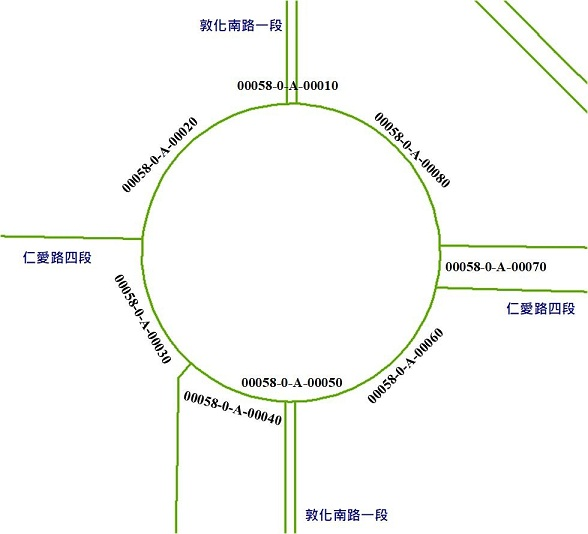
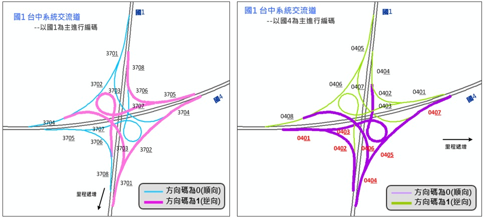
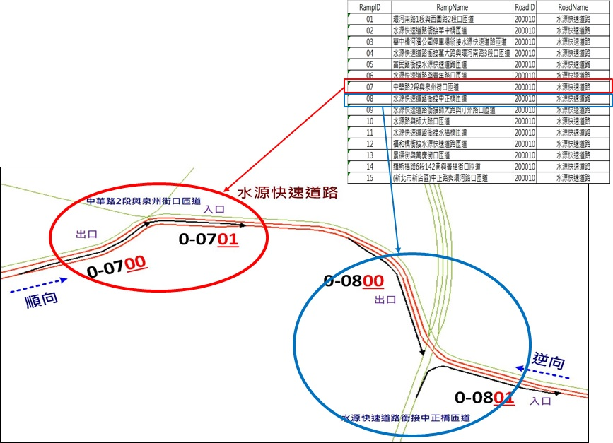

&emsp;&emsp;序號碼為同名道路之路段次序 (依方向碼順向分段及定義)，為5碼數字。序號碼定義依道路分類不同而異，分述如后。下表為序號碼編碼基準說明。

1\. 國道、省道快速公路、市區快速道路、省道一般公路、縣道、鄉道(含區道)

&emsp;&emsp;–	以里程編碼，以AAAK+BB里程紀錄至10公尺。異動直接以里程表示新的段點，故仍具路段次序之特性。

&emsp;&emsp;–	自里程數增加方向編號，配合路段起始點里程數，10公尺1號。如：路段起始點里程數為25.4公里，該路段序號碼為02540，下圖為國道序號碼範例。

&emsp;&emsp;–	首段序號為00000，雙向各自編號。

&emsp;&emsp;–	新闢或刪除道路時，多半會在原路網產生新的分段點；原有道路縮減或改建時，則可能刪除原路網既有分段點，這些情況均會對原編碼產生變動，故有必要針對受影響之既有路段依里程進行編碼。

&emsp;&emsp;–	新增節點時，路段編碼依據新增節點之里程數，給予編碼。

&emsp;&emsp;–	刪除節點時，原路段編碼將暫時註銷(Disabled)。

2\. 市區一般道路：依據道路走向由北至南、由西至東、由東北向西南或由西北向東南依序遞增進行編號，首段序號為00000，雙向各自編號，下圖為市區道路序號碼範例。

&emsp;&emsp;–	編碼序號以00000,00010,00020……，可視為1組十位數號碼。

&emsp;&emsp;–	異動時啟動個位數序號，以保持路段次序的特性。

&emsp;&emsp;–	市區道路異動備用碼為第5碼數字，作為路段更新時使用。備用碼之使用可分「新增道路節點」與「刪除道路節點」兩種情況。

&emsp;&emsp;&emsp;&emsp;–	新闢道路時，多半會在原路網產生新的分段點；原有道路縮減或改建時，則可能刪除原路網既有分段點，這些情況均會對原編碼產生變動，故有必要針對受影響之既有路網進行更新。以下圖為例，原南京東路三段(路段編碼為6-00199-0-0002-0)中新增節點時，原路段編碼將暫時註銷(Disabled)，並於原路段產生兩個新路段，依據「路段編碼」備用碼之說明，新增1節點時，新增兩路段之備用碼為3與6。因此，新增路段之編碼分別為6-00199-0-0002-3與6-00199-0-0002-6。

&emsp;&emsp;&emsp;&emsp;–	以下圖為例，原南京東路五段(路段編碼為6-00201-0-0002-0與6-00201-0-0003-0)須整併為一路段時，原有兩路段編碼將暫時註銷(Disabled)，整併後之路段之備用碼，依據「路段編碼」備用碼之說明，刪除1節點時，新路段之序號與備用碼為前後兩路段序號與備用碼組合之數字(此例為20與30)相加除以二(此例為25)，故新路段之編碼為6-00201-0-0002-5。

3\. 圓環：省道、縣道及鄉道共線遇圓環且與市區道路共線時，圓環屬省道、縣道及鄉道共線之道路分類不編碼，僅針對市區道路分類進行編碼，序號碼編碼方式依圓環與其他道路相交時視為一分段，自正北方向為起始依逆時針方向遞增編列，首段序號為00000，下圖為圓環序號碼範例。圓環之編碼異動同市區道路異動原則進行更新。

4\. 交流道：並依下述原則依序編列，下圖為交流道序號碼範例。

&emsp;&emsp;–	前2碼為交流道系統編號，後2碼為交流道流水號，第5碼為異動備用碼。

&emsp;&emsp;–	編碼序號以01000,01010,01020,……，可視為1組十位數號碼。

&emsp;&emsp;–	異動時啟動個位數序號之異動備用碼作業原則，以保持路段次序。

&emsp;&emsp;&emsp;&emsp;(\1)	依交流道出入口判斷，先編出口再編入口。

&emsp;&emsp;&emsp;&emsp;(\2)	依里程遞增遞減方向判斷，里程遞增先編，里程遞減後編。

&emsp;&emsp;&emsp;&emsp;(\3)	遇分叉路時，右側路段優先編號。

&emsp;&emsp;&emsp;&emsp;(\4)	若線段之歸屬有特殊情況者，則依其所連接之代表匝道(RAMP)進行編列。

5\. 市快匝道: 並依下述原則依序編列，下圖為匝道序號碼範例。

&emsp;&emsp;–	前兩碼為市快交流道編號，後2碼為匝道流水號，第5碼為異動備用碼。

&emsp;&emsp;–	依匝道出入口判斷，先編出口再編入口。

&emsp;&emsp;–	依里程遞增遞減方向判斷，里程遞增先編，反之遞減後編。

