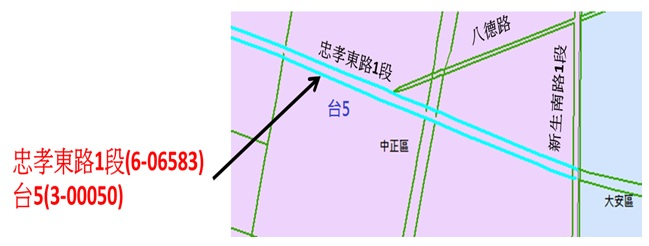

&emsp;&emsp;由於部分路段同時隸屬多個不同的道路分類，致同路段擁有多個路名的情況(亦即所謂的「道路共線」)。基於路況使用的特殊需求(常以道路分類查詢路況)，有必要針對共線路段的不同道路分類給予不同的路段識別。故在圖資與編碼的處理上，不同道路分類之路段各自擁有路段圖資與編碼。共線道路的路段將產生重覆的路段圖資以及多重編碼。此時，這些共線路段將相互參照(亦即某道路分類的路段，將參照至共線路段資料表的多個共線路段之編碼)，以保持對應。以臺北市忠孝東路1段部分路段為例，同時為省道一般公路台5線，故這些路段均擁有兩個不同道路分類與路名的路段編碼，其編碼前6碼之範例如下圖所示。

