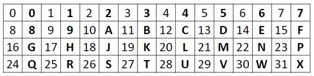

&emsp;&emsp;路段節點之編碼直接採用「臺灣通用電子地圖」道路節點識別碼(NODEID)之編碼方式，不另行編碼。以下概略說明「臺灣通用電子地圖」道路節點識別碼之編碼方式，詳細編碼內容請見「臺灣通用電子地圖使用手冊」。

&emsp;&emsp;臺灣通用電子地圖」道路節點識別碼係利用道路節點的TWD97 TM2 121度坐標(EPSG:3826)進行32位元轉碼。考量數化的人為誤差，道路節點距離2.5米以內視為同1點。TWD97 TM2 121度坐標投影採用10萬公尺方格帶，X坐標為6位整數，Y坐標為7位整數。進行32位元編碼前， Y坐標減2000000。例如：臺北市某點坐標為(300500, 2770000)，將Y坐標減去2000000，故轉換前的參考坐標成為(300500,770000) 。32 進位代碼定義如下：

&emsp;&emsp;「0,1,2,3,4,5,6,7,8,9,A,B,C,D,E,F,G,H,J,K,L,M,N,P,Q,R,S,T,U,V,W,X 」，其中字母 I、O不用，避免和數字混淆，代碼對應如下表所示：

&emsp;&emsp;前述參考坐標(300500,770000)分別以 32 進位計算，可得如下轉換值：

&emsp;&emsp;300500->95EL；770000-->PFWG，兩字串相加可得 95ELPFWG，共計8位數。
